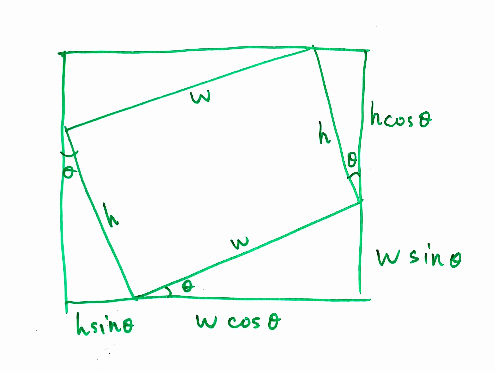
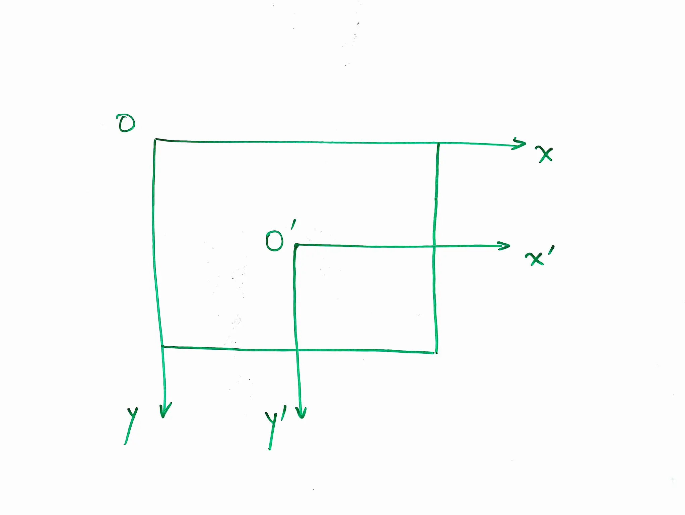

Performing arbitrary angle rotations on images is a common task in image processing. But if you try it yourself, you may find that it is not as straightforward as it seems. The main challenge is that the rotated image may not align perfectly with the original pixel grid, leading to some pixels being left out or interpolated. This also results in the rotated image having a different size than the original image. 


First, to ensure the rotated image is fully contained within the output image, we need to calculate the size of the output image based on the rotation angle. The following figure illustrates this concept:



So the size of the output image can be calculated as follows:
$$
\text{output\_width} = \left\lceil |\text{width} \cdot \cos(\theta)| + |\text{height} \cdot \sin(\theta)| \right\rceil
$$
$$
\text{output\_height} = \left\lceil |\text{height} \cdot \cos(\theta)| + |\text{width} \cdot \sin(\theta)| \right\rceil
$$

Second, we move the origin of the coordinate system to the center of the image, so that we can rotate the image around its center. The following figure illustrates this concept:



The center of the original image is at $(x_{sc}, y_{sc}) = \left(\frac{\text{width}-1}{2}, \frac{\text{height}-1}{2}\right)$, and the center of the output image is at $(x_{oc}, y_{oc}) = \left(\frac{\text{output\_width}-1}{2}, \frac{\text{output\_height}-1}{2}\right)$.

Then, we do an inverse rotation to find the corresponding pixel in the original image for each pixel in the output image. The inverse rotation can be expressed as follows:

$$
\begin{bmatrix}
x_s \\
y_s
\end{bmatrix}
=
\begin{bmatrix}
\cos(\theta) & -\sin(\theta) \\
\sin(\theta) & \cos(\theta)
\end{bmatrix}
\begin{bmatrix}
x_o - x_{oc} \\
y_o - y_{oc}
\end{bmatrix}
+
\begin{bmatrix}
x_{sc} \\
y_{sc}
\end{bmatrix}
$$

Note this inverse rotation is a clockwise rotation, which is the opposite of the counterclockwise rotation we want to achieve. This is because we are mapping from the output image back to the original image. Also, the rotation matrix is different from the standard rotation matrix because we are using a coordinate system where the y-axis points downwards, which is common in image processing.

Finally, we can use bilinear interpolation to calculate the pixel value at $(x_s, y_s)$ in the original image. The following figure illustrates this concept:


A horizontal linear interpolation is performed first, followed by a vertical linear interpolation. The final pixel value is a weighted average of the four neighboring pixels, with weights based on the distances to the neighboring pixels.

$$
\begin{bmatrix}
x_s \\
y_s
\end{bmatrix}
=
\begin{bmatrix}
\cos(\theta) & -\sin(\theta) \\
\sin(\theta) & \cos(\theta)
\end{bmatrix}
\begin{bmatrix}
x_o - x_{oc} \\
y_o - y_{oc}
\end{bmatrix}
+
\begin{bmatrix}
x_{sc} \\
y_{sc}
\end{bmatrix}
$$

Note this inverse rotation is a clockwise rotation, which is the opposite of the counterclockwise rotation we want to achieve. This is because we are mapping from the output image back to the original image. Also, the rotation matrix is different from the standard rotation matrix because we are using a coordinate system where the y-axis points downwards, which is common in image processing.

Finally, we can use bilinear interpolation to calculate the pixel value at $(x_s, y_s)$ in the original image. The following figure illustrates this concept:


A horizontal linear interpolation is performed first, followed by a vertical linear interpolation. The final pixel value is a weighted average of the four neighboring pixels, with weights based on the distances to the neighboring pixels.

$$
\begin{aligned}
\text{pixel\_value} &= (1 - w_x)(1 - w_y) \cdot I(x_0, y_0) + w_x(1 - w_y) \cdot I(x_1, y_0) \\
&\phantom{+} + (1 - w_x)w_y \cdot I(x_0, y_1) + w_x w_y \cdot I(x_1, y_1)
\end{aligned}
$$


The full python code for rotating an image using bilinear interpolation is as follows:

```python
def manual_rotate_bilinear(mat: np.ndarray, angle_degrees: float, *, expand: bool = True, fill_value = 0):
    original_dtype = mat.dtype
    source = mat.astype(np.float64)
    height, width = source.shape[:2]

    theta = np.deg2rad(angle_degrees)
    cos_theta = np.cos(theta)
    sin_theta = np.sin(theta)

    # calculate the size of the rotated picture
    theta = np.deg2rad(angle_degrees)
    cos_theta = np.cos(theta)
    sin_theta = np.sin(theta)

    # calculate the size of the rotated picture
    if expand:
        output_width = int(np.ceil(
            abs(width * cos_theta) + abs(height * sin_theta)
        ))
        output_height = int(np.ceil(
            abs(height * cos_theta) + abs(width * sin_theta)
        ))
    else:
        output_height = height
        output_width = width

    output_shape = (output_height, output_width) + source.shape[2:]
    output = np.full(output_shape, fill_value, dtype=np.float64)

    # the center of the source and the output
    source_cx = (width - 1) / 2
    source_cy = (height - 1) / 2
    output_cx = (output_width - 1) / 2
    output_cy = (output_height - 1) / 2

    for output_y in range(output_height):
        for output_x in range(output_width):
            # coordinate relative to the center
            x = output_x - output_cx
            y = output_y - output_cy

            # inverse rotation: rotate the source pixels clockwise to the output 
            source_x = cos_theta * x - sin_theta * y + source_cx
            source_y = sin_theta * x + cos_theta * y + source_cy

            x0 = int(np.floor(source_x))
            y0 = int(np.floor(source_y))
            x1 = x0 + 1
            y1 = y0 + 1

            if x0 < 0 or y0 < 0 or x1 >= width or y1 >= height:
                continue

            # Fractional position between neighboring pixels.
            wx = source_x - x0
            wy = source_y - y0

            # bilinear interpolation
            top = (
                (1 - wx) * source[y0, x0]
                + wx * source[y0, x1]
            )

            bottom = (
                (1 - wx) * source[y1, x0]
                + wx * source[y1, x1]
            )

            output[output_y, output_x] = (
                (1 - wy) * top
                + wy * bottom
            )

    if np.issubdtype(original_dtype, np.integer):
        limits = np.iinfo(original_dtype)
        output = np.clip(output, limits.min, limits.max)

    return output.astype(original_dtype)
```