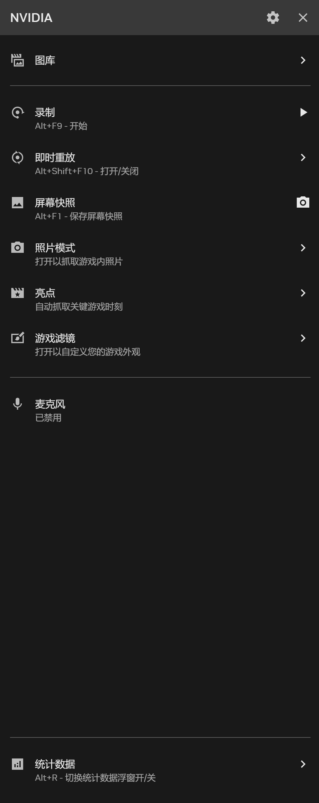
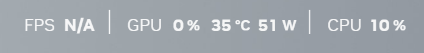

People often say GPUs consume a lot of power, but how much exactly? Sometimes we want to know the GPU’s power draw and temperature under different workloads, ideally with some real-time monitor. In Windows Task Manager, you can see GPU usage and temperature, but not power consumption.

I use an NVIDIA GPU, and NVIDIA actually provides a good official tool for this. When you install the NVIDIA graphics driver, the NVIDIA App is usually installed as well. If it is already installed, press `Ctrl + Alt + Z`, and a sidebar will appear on the left side of the screen.

In the **Statistics** tab, turn on “Show statistics in overlay,” and GPU-related information will appear on screen.

You can also customize the statistics view to show the metrics you actually care about. Mine looks like this:

