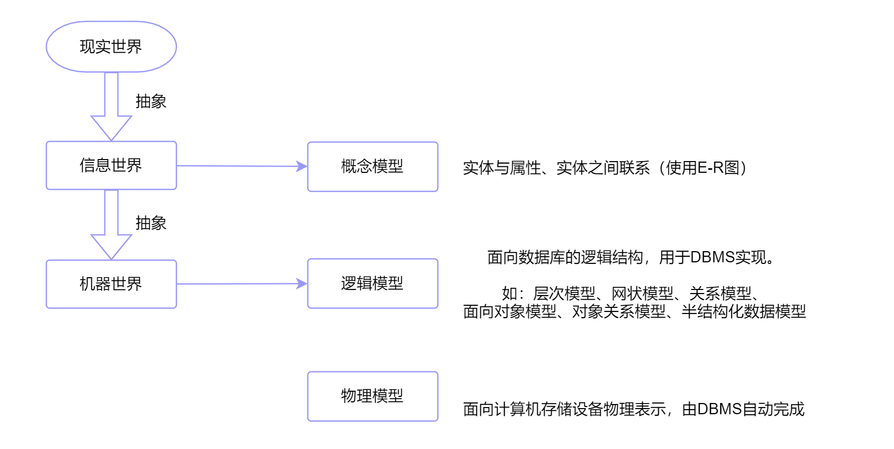
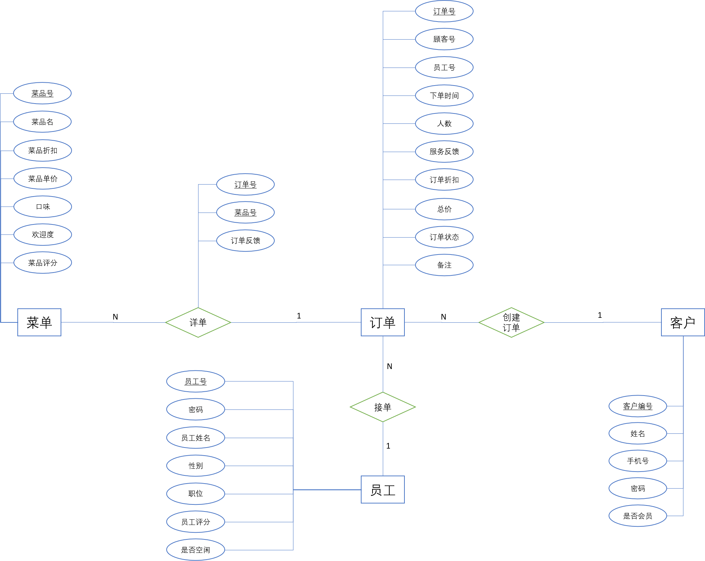

## Basic concepts of database systems

### From data to databases

**Data** carries information, while its concrete form is a symbolic record.

From the viewpoint of structure, data is often divided into three categories:

| Type | Meaning | Typical examples |
| --- | --- | --- |
| Structured data | Data that can be directly stored and managed by relational databases | Tables in an RDBMS |
| Semi-structured data | Data that can be organized and stored after some additional processing | HTML, XML |
| Unstructured data | Data without an obvious unified structure | Audio, images, videos |

A **database (DB)** is a collection of data organized and stored according to a certain structure.

Its two key characteristics are:

- **integration**: related data is stored together under a unified structure;
- **sharing**: the same data can be used by multiple applications or users.

A **database management system (DBMS)** is the software layer that manages databases. Its responsibilities include definition, manipulation, transaction control, concurrency control, security, and recovery.

## Data models

A **data model** is an abstraction used to describe data, the relationships among data, and the operations applied to them.



The conceptual model most commonly used in database design is the **Entity-Relationship (ER) model**.

Its three core elements are:

- **entity**
- **attribute**
- **relationship**



## The relational model

The relational model is the core model used in modern database systems.

Its main concepts are:

- **relation**: a table;
- **tuple**: a row;
- **attribute**: a column;
- **domain**: the value set of an attribute;
- **key**: an attribute or attribute set that identifies tuples.

Important types of keys include:

- **candidate key**
- **primary key**
- **foreign key**

## Relational algebra and SQL

Relational algebra provides the formal basis for relational queries.

Common operations:

- selection
- projection
- union
- difference
- Cartesian product
- join
- division

SQL can be divided into:

- **DDL**: data definition language
- **DML**: data manipulation language
- **DQL**: data query language
- **DCL**: data control language

Example:

```sql
CREATE TABLE Student (
    Sno CHAR(10) PRIMARY KEY,
    Sname VARCHAR(50),
    Age INT
);
```

```sql
SELECT Sname, Age
FROM Student
WHERE Age >= 18;
```

## Integrity, transactions, and recovery

Relational databases usually enforce several kinds of integrity constraints:

- **entity integrity**
- **referential integrity**
- **user-defined integrity**

A **transaction** is a logical unit of work. The classical ACID properties are:

- **Atomicity**
- **Consistency**
- **Isolation**
- **Durability**

Database systems also need:

- concurrency control;
- logging;
- crash recovery;
- backup and restore;
- authentication and authorization.

## Final remarks

This review only sketches the backbone of introductory database theory, but the structure is clear:

1. understand what a database system is;
2. understand data models, especially the relational model;
3. understand relational algebra and SQL;
4. understand integrity, transactions, concurrency, recovery, and security.

