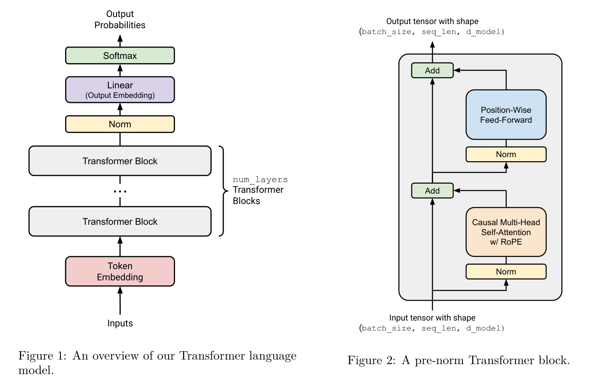

## 0. Introduction: the mathematical definition of language modeling

Natural language can be viewed as a discrete sequence generated from a finite vocabulary $\mathcal{V}$:

$$
x_1, x_2, \dots, x_T,\quad x_t \in \mathcal{V}.
$$

The goal of a language model is to define the probability distribution

$$
p(x_1,\dots,x_T)=\prod_{t=1}^{T} p(x_t \mid x_{<t}),
$$

where $x_{<t}=x_1,\dots,x_{t-1}$.

## 1. The decoder-only Transformer

Modern language models such as GPT and LLaMA typically use the **decoder-only Transformer**, because it naturally matches autoregressive prediction.

### 1.1 Input representation: token embedding + position embedding

Each token id is first mapped into a vector:

$$
e_t = E[x_t] \in \mathbb{R}^d,
$$

where $E \in \mathbb{R}^{|\mathcal{V}|\times d}$ is the embedding matrix.

Because attention by itself does not encode position, we add a positional vector $p_t$:

$$
h_t^{(0)} = e_t + p_t.
$$

## 2. The Transformer block

Each Transformer layer contains two main parts:

1. masked self-attention
2. feed-forward network

with residual connections and layer normalization.

### 2.1 Linear projections to Q, K, and V

Let the input to a layer be

$$
H = (h_1,\dots,h_T) \in \mathbb{R}^{T\times d}.
$$

We compute

$$
Q = HW_Q,\quad K = HW_K,\quad V = HW_V.
$$

Intuitively:

- **Q** asks what information I want;
- **K** describes what kind of information each token offers;
- **V** carries the actual content that will be aggregated.

### 2.2 Scaled dot-product attention

The raw similarity matrix is

$$
S = \frac{QK^\top}{\sqrt{d_k}}.
$$

### 2.3 Causal masking

For language modeling, token $t$ must not see the future. So we apply a causal mask:

$$
M_{ij}=
\begin{cases}
0, & j\le i,\\
-\infty, & j>i.
\end{cases}
$$

### 2.4 Softmax attention

The normalized attention matrix is

$$
A = \text{softmax}(S+M).
$$

### 2.5 Information aggregation

The output at position $i$ is

$$
output_i = \sum_{j=1}^{T} a_{i,j} V_j.
$$

## 3. Multi-head attention and FFN

Instead of using a single attention mechanism, the model splits the representation into several heads. Each head can focus on a different type of dependency.

After attention, each token representation passes through a position-wise feed-forward network:

$$
\text{FFN}(x)=W_2 \sigma(W_1 x + b_1)+b_2.
$$

## 4. Final remarks

If I had to summarize the whole picture in one sentence, it would be this:

> A decoder-only Transformer is a machine that repeatedly decides what each token should attend to, then updates the representation accordingly, while never looking into the future.

