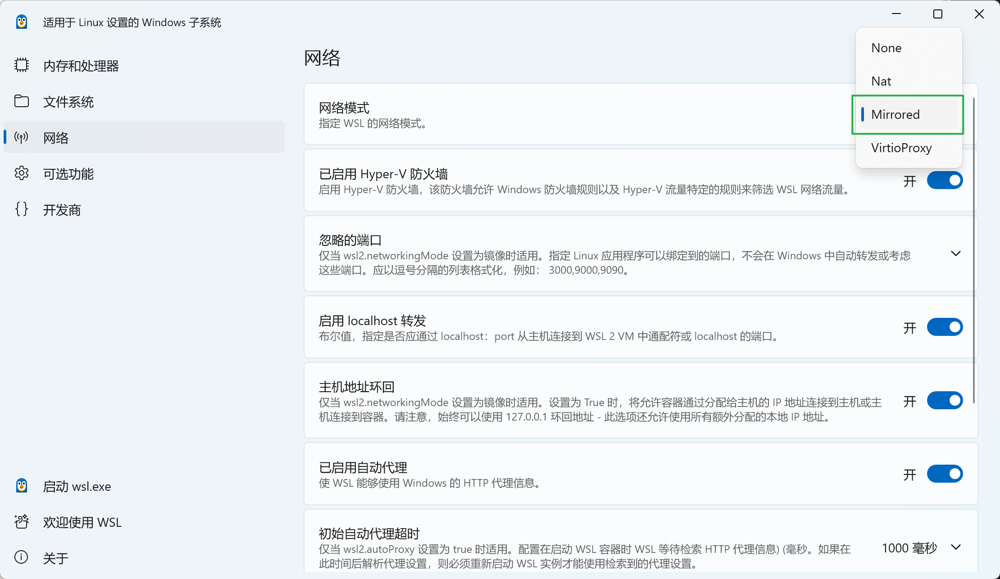

When I installed WSL 2 on a new system, I saw this message:

> wsl: A localhost proxy configuration was detected but not mirrored into WSL. WSL in NAT mode does not support localhost proxies.

That immediately reminded me of a long-standing headache:

- WSL 2 usually cannot use the Windows proxy directly, which makes proxy setup for **git** and **GitHub** more annoying than it should be
- The IP address visible from WSL 2 is usually an internal virtual IP rather than one accessible to other devices on the local network, which makes **LAN testing** more inconvenient

By default, WSL 2 uses NAT networking. The message above shows that WSL now supports **mirrored networking**. In mirrored mode, WSL supports localhost proxies. That means WSL 2 and Windows can share network settings and proxy behavior automatically.

### How to enable mirrored networking

- Open **WSL Settings** in Windows
- Go to the **Network** tab
- Change the network mode from **NAT** to **Mirrored**
- Restart WSL for the change to take effect  
  (run `wsl --shutdown` in PowerShell, then open WSL again)

At that point, the problems above are basically solved.
