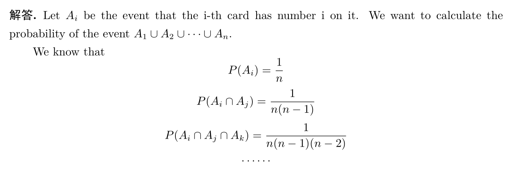
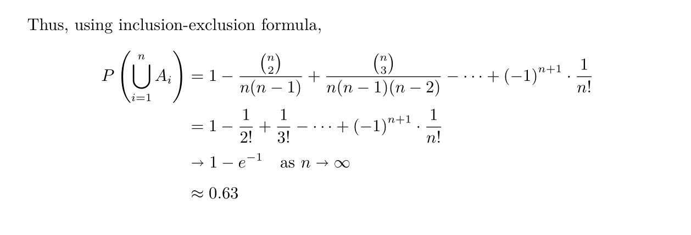

## Vectors

To create a vector, use the `c`  command, which stands for *concatenate or combine*.

```R
> v <- c(3,1,4,1,5,9)
```

To create a scalar, type

```R
> n <- 100
```

and R views n as a vector of length 1.

We can know many properties of a vector immediately. For instance, `sum(V)`  adds up all the components of a vector and `max(v)` gives the largests element of v, `length(v)` returns the length of the vector v.

```R
> sum(v)
[1] 23
> max(v)
[1] 9
> min(v)
[1] 1
> length(v)
[1] 6
```

Generating a subvector from an existing vector is easy

```R
> v[c(1,3,5)]
[1] 3 4 5
> v[-(2:4)]
[1] 3 5 9
```

Put the `c` command in the brackets,  say`v[c(1,3,5)]` concatenates the 1st, 3rd and 5th element of the vector v and forms a new vector. `v[-(2:4)]` excludes the 2nd through 4th element from v.

> Notice in R the index is labelled from 1 rather than 0 !

There's a shortcut for getting the vector (1,2, ... , n), see

```R
v2 = 1:28
```

Operations in R are performed component wise, e.g.

```R
1/(1:20)^5
```

means $(1,1/2^5,1/3^5,\ldots,1/20^5)$ .

If we add a shorter vector to a longer one, what will happen? see

```R
> v <- c(3,1,4,1,5,9)
> v3 <- c(100, 200)
> v + v3
[1] 103 201 104 201 105 209
```

v3 is "recycled" and adds to v in a cycle.


## Factorials and Binomial Coefficients

We get $n!$ by `factorial(n)`, get $\binom{n}{k}$ by `choose(n,k)`.

What if  $n!$  or  $\binom{n}{k}$ get too large to compute? Fortunately, R gives functions to compute  $\log{n!}$  or  $\log{\binom{n}{k}}$ , by using `lfactorial(n)` and `lchoose(n,k)` respectively.


## R for probability - Sampling and simulation

The sample command generates random samples in R.

```R
> n <- 10; k <- 5
> sample(n,k)
```

generates a random sample of 5 from 1 to 10, without replacement and with equal probability assigned to each number.

We can also generate samples with replacement and give a probability to each number:

```R
> sample(4, 10, replace = TRUE, prob = c(0.1, 0.2, 0.3, 0.4))
 [1] 3 4 4 4 3 2 4 3 3 2
```

The above example draws 10 samples from {1, 2, 3, 4}, the probability of 1, 2, 3, 4 is respectively 0.1, 0.2, 0.3, 0.4 


Use the `replicate` command generates many samples so that we can perform a simulation for a probability problem. Here is an example

> **Problem (matching problem)** Consider a well-shuffled deck of n cards, labeled 1 through n. You flip over the cards one by one, saying the number 1 through n as you do so. You win the game if, at some point, the number you say aloud is the same as the number on the card being flipped over. What is the probability of winning?



 

Simulation goes as follows

```R
> n <- 100
> r <- replicate(10^4, sum(sample(n)==(1:n)))
> sum(r>=1)/10^4
[1] 0.6344
```

in which we generated $10^4$ examples and calculated the frequency of winning. The result agrees with mathematical derivation.