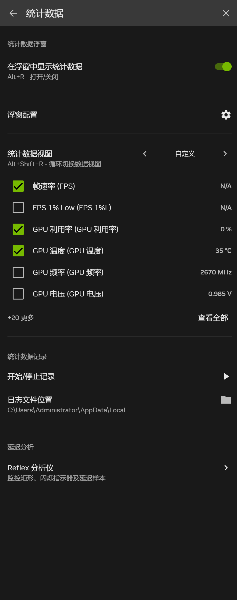

都说GPU功率不小，那么到底有多大呢？我们希望知道GPU在不同任务时的功耗和温度表现，最好是有某种实时监测器。Windows中的任务管理器里面，能够看到GPU的负载以及温度，但是无法看到功耗。

我使用的是NVIDIA的GPU，NVIDIA官方其实提供了很好的工具去实现这一需求。在安装英伟达显卡驱动程序的时候会默认同时安装NVIDIA App软件，如果已经安装，按住Ctrl+Alt+Z，在屏幕左侧会弹出侧边栏。

在**统计数据**选项卡中，打开“在浮窗中显示统计数据”，你可以看到GPU相关信息在屏幕上显示出来。

你还可以设置喜欢的统计数据视图，显示那些你关心的数据信息。我的效果如下：

